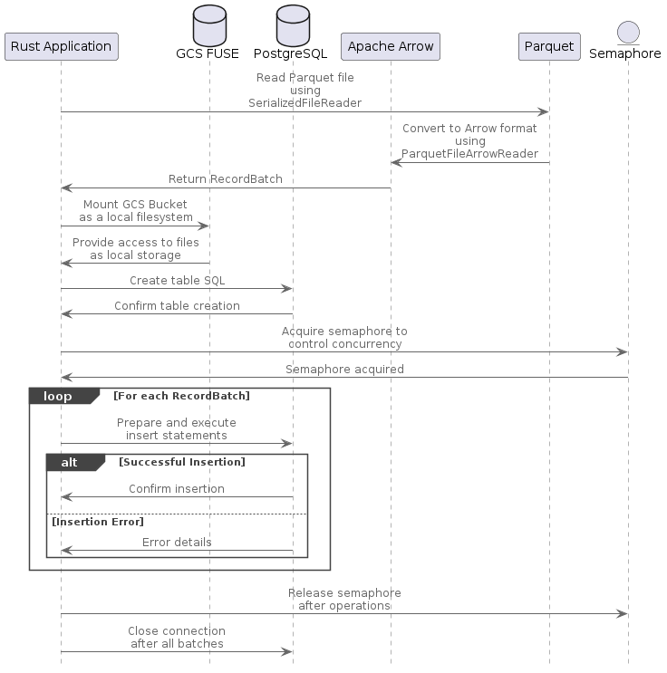

# Fusing Arrow, Parquet, and Postgres: A Rustic Approach

## Introduction

In today's data-driven landscape, seamlessly integrating cloud storage with database systems is crucial for efficient data processing. This blog post explores a Rust application designed to load Parquet files from Google Cloud Storage (GCS) into PostgreSQL, capitalizing on Rust's renowned performance and safety.

## What is GCS Fuse?

GCS Fuse is a tool that mounts Google Cloud Storage buckets as local file systems on Linux or macOS. This facilitates direct interaction with cloud storage using familiar file system operations.

### Advantages

- **Ease of Use**: Simplifies cloud data management by integrating with traditional file-based applications without major modifications.
- **Flexibility**: Supports standard file operations on cloud objects, enhancing data handling capabilities.

### Limitations

- **Performance**: May introduce latency and decrease I/O performance compared to using direct cloud APIs, particularly noticeable in data-intensive applications.

## The Rust Solution

Rust is celebrated for its performance and safety, offering an optimal choice for resource-intensive operations. It ensures memory safety without a garbage collector, providing both speed and reliability.

### Application Architecture



Below is a simplified architecture of a Rust application that reads Parquet files and writes data into PostgreSQL:

```rust
use parquet::file::reader::{FileReader, SerializedFileReader};
use std::sync::Arc;
use std::fs::File;

let file = File::open("data.parquet")?;
let file_reader = SerializedFileReader::new(file)?;
let mut arrow_reader = ParquetFileArrowReader::new(Arc::new(file_reader));

let insert_statement = "INSERT INTO my_table VALUES ($1, $2, $3)";
```

## Integrating GCS Fuse

### Installation on Debian/Ubuntu

```bash
# Add the GCSFUSE repository
echo "deb http://packages.cloud.google.com/apt gcsfuse-$(lsb_release -c -s) main" | sudo tee /etc/apt/sources.list.d/gcsfuse.list

# Import the Google Cloud public key
curl https://packages.cloud.google.com/apt/doc/apt-key.gpg | sudo apt-key add -

# Install gcsfuse
sudo apt-get update
sudo apt-get install gcsfuse
```

### Configuration and Usage

```bash
# Create a local directory and mount the GCS bucket
mkdir /path/to/mount
gcsfuse my-bucket /path/to/mount

# To unmount the bucket
fusermount -u /path/to/mount
```

The Rust application interacts with the mounted directory as if it were local storage, simplifying cloud data handling.

#### Performance Optimization

For I/O-heavy applications using GCS Fuse, optimizing caching and read/write configurations can significantly enhance performance. Adjusting the cache size and prefetch settings are beneficial for improving data throughput.

## What is Apache Arrow?

Apache Arrow is a cross-language development platform for in-memory data. It standardizes a memory-efficient format for columnar data representation, enhancing processing and interchange between systems.

### Role of Apache Arrow

Apache Arrow facilitates the efficient translation of Parquet data into a format that can be directly ingested by PostgreSQL, streamlining the data flow in our Rust application.

## Demonstration and Results

This section provides a detailed walkthrough from setup to execution, demonstrating the entire process of using GCS Fuse with our Rust application to process and load Parquet data into PostgreSQL.

### Installation and Setup

Before installing Rust, you need to ensure that your system has curl, gcc, and build-essential installed, which are required for compiling Rust programs.

```bash
curl --proto '=https' --tlsv1.2 -sSf https://sh.rustup.rs | sh
source $HOME/.cargo/env
```

## Building and Running the Application

Clone the repository, configure the application settings, and execute:

```bash
git clone https://github.com/TFMV/parquet_to_postgres.git
cd parquet_to_postgres
cargo build
cargo run
```

## Results

Rows Inserted: 1_500_000

Time Taken: 2.96 seconds

## Conclusion

The integration of GCS Fuse, Rust, and Apache Arrow offers a robust solution for managing data workflows involving cloud storage and SQL databases. While there are performance considerations, the overall utility and flexibility provided make this approach highly effective for specific use cases.

Remember to always weigh the convenience against performance metrics specific to your needs to make the most informed decision.
