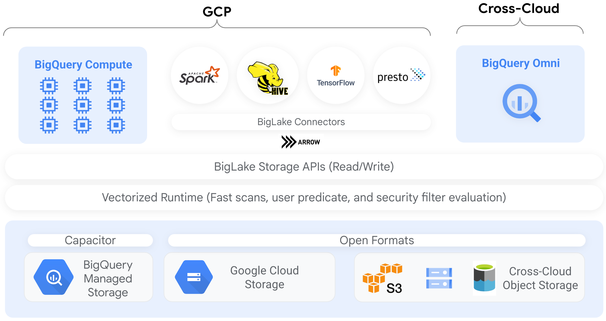

# Revolutionizing Data Architecture with Iceberg and BigLake


In the chaotic landscape of big data, where the stakes are high and the margins thin, efficiency in data management and analytics isn't just a luxury—it's a lifeline. Enter Apache Iceberg and Google Cloud Platform's BigLake, the dynamic duo poised to revolutionize the way we handle sprawling, complex datasets. Buckle up, folks. We're about to dive deep into the technical heart of these game-changers and see how their combined prowess can reshape data infrastructure as we know it.

## Apache Iceberg: A Modern Data Format

Apache Iceberg isn't just another data format; it's the modern knight in shining armor for huge analytic datasets. Created to address the pitfalls of the aging Hive table format, Iceberg packs a punch with a slew of advanced features:

### Key Features of Apache Iceberg

- **Transactional Consistency:** Iceberg tables ensure ACID transactions, providing rock-solid data integrity for concurrent operations. Forget about dirty reads and phantom writes—this is the real deal.
- **Schema Evolution:** Adding, removing, or renaming columns? No sweat. Iceberg supports seamless schema evolution, eliminating the need for costly, time-consuming migrations.
- **Partitioning and Pruning:** With advanced partitioning strategies, Iceberg enhances query performance by pruning irrelevant data early. For vast datasets, this means lightning-fast queries without the overhead.
- **Snapshot Isolation:** Time travel isn't just for sci-fi. Iceberg maintains a history of table snapshots, enabling you to run time-travel queries and rollbacks. Perfect for debugging and historical analysis.
- **Data Versioning:** Each commit to an Iceberg table creates a new version, allowing easy reversion to previous states. Data corruption? Just roll back to a known good version.

## GCP BigLake: Unified Data Lake Architecture

Google Cloud BigLake extends the formidable capabilities of BigQuery to data stored in a plethora of formats—Parquet, ORC, Avro, you name it—across different storage systems like Google Cloud Storage and BigQuery itself.

### Key Features of GCP BigLake

- **Federated Queries:** BigLake enables you to query data across multiple storage systems, providing a unified view without the need for data movement. Say goodbye to data silos.
- **Performance Optimization:** Leveraging BigQuery's performance enhancements—intelligent caching, execution plans, columnar storage—BigLake ensures blazing-fast query responses.
- **Security and Governance:** BigLake integrates seamlessly with Google Cloud's security tools, offering robust data access controls, auditing, and compliance management.
- **Cost Efficiency:** Query data in place, reducing the need for data duplication and movement. This translates to significant cost savings on both storage and processing.

## The Frenzied Symphony of GCP BigLake Architecture



In the heart of the digital wilds, where data flows like a psychedelic river through the canyons of Silicon Valley, Google Cloud Platform's BigLake stands as a towering monolith of innovation. The architecture of BigLake is a testament to the relentless pursuit of data nirvana, combining the raw power of compute with the fluidity of cross-cloud orchestration.

### GCP BigLake Architecture: A Dive into the Madness

#### BigQuery Compute: The Cerebral Cortex

At the forefront, BigQuery Compute is the cerebral cortex of this digital behemoth. Like an army of electric neurons firing in unison, it handles the heavy lifting of data processing, ensuring that queries are executed with ruthless efficiency. This is the nerve center where data dreams are realized, powered by the raw horsepower of distributed computing.

#### BigLake Connectors: The Bridge Over Troubled Data

Connecting the chaotic realms of data storage are the BigLake Connectors. These are the unsung heroes, the bridges over troubled data waters, facilitating seamless interaction between BigQuery and various data formats. Apache Spark, Hive, TensorFlow, Presto – all join hands in a cosmic dance, orchestrated by the Arrow connector, ensuring that data flows freely and efficiently across the ecosystem.

#### BigLake Storage APIs: The Veins of the System

The BigLake Storage APIs are the veins coursing through this digital organism, enabling read and write operations with surgical precision. With a vectorized runtime, these APIs offer fast scans, user predicate evaluation, and robust security filtering, ensuring that data is not only accessible but also protected from the ever-looming specter of cyber threats.

#### The Vectorized Runtime: Speed Demons of Data

Beneath the hood lies the vectorized runtime – the speed demons of data processing. These mechanisms are finely tuned to deliver rapid query results, optimizing performance through intelligent caching and execution plans. It's a high-octane race to the finish line, where milliseconds matter and every byte counts.

#### Capacitor and Open Formats: The Foundation of Storage

At the foundation of this architectural marvel lies the dual pillars of storage – Capacitor and Open Formats. BigQuery Managed Storage and Google Cloud Storage form the bedrock, providing a stable and scalable platform for data retention. Meanwhile, open formats like Parquet and ORC ensure compatibility and flexibility, allowing data to be stored and accessed in the most efficient manner possible.

#### BigQuery Omni: The Cross-Cloud Conductor

And finally, in the grand symphony of BigLake architecture, BigQuery Omni serves as the cross-cloud conductor. It extends the reach of BigQuery beyond the confines of GCP, enabling seamless queries across different cloud platforms. This is the maestro that orchestrates harmony in a multi-cloud world, breaking down silos and unifying data under one cohesive framework.

## Integrating Iceberg with BigLake

Bringing Apache Iceberg and GCP BigLake together is like combining two unstoppable forces in data architecture. Here's how to leverage their combined strengths:

### Setting Up Iceberg Tables

Creating Iceberg tables involves defining schemas, creating namespaces, and managing table properties through Iceberg's APIs. Here's a taste of the Rust code that gets the job done:

```rust
use iceberg::{Schema, Table, Namespace, RestCatalog, RestCatalogConfig};

async fn create_iceberg_table() -> Result<(), Box<dyn std::error::Error>> {
    let config = RestCatalogConfig::builder()
        .uri("http://localhost:8080")
        .build();
    
    let catalog = RestCatalog::new(config).await?;

    let namespace_id = Namespace::from_parts(vec!["ns1".to_string(), "ns11".to_string()])?;
    let ns = catalog.create_namespace(&namespace_id, Some(&[("key1", "value1")])).await?;
    println!("Namespace created: {:?}", ns);

    let schema = Schema::builder()
        .with_column("id", "int")
        .with_column("name", "string")
        .build()?;

    let table = Table::builder()
        .name("example_table")
        .namespace(namespace_id)
        .schema(schema)
        .build()?;
    
    catalog.create_table(&table).await?;
    println!("Table created: {:?}", table);

    Ok(())
}
```

Alternatively

```SQL
 # Creates a stored procedure that initializes BLMS and database.
 # Creates a table in the database and populates a few rows of data.
 CREATE OR REPLACE PROCEDURE iceberg_demo.iceberg_setup_3_3 ()
 WITH CONNECTION `PROCEDURE_CONNECTION_PROJECT_ID.PROCEDURE_CONNECTION_REGION.PROCEDURE_CONNECTION_ID`
 OPTIONS(engine="SPARK",
 jar_uris=["gs://spark-lib/biglake/biglake-catalog-iceberg1.2.0-0.1.0-with-dependencies.jar"],
 properties=[
 ("spark.jars.packages","org.apache.iceberg:iceberg-spark-runtime-3.3_2.12:1.2.0"),
 ("spark.sql.catalog.CATALOG", "org.apache.iceberg.spark.SparkCatalog"),
 ("spark.sql.catalog.CATALOG.catalog-impl", "org.apache.iceberg.gcp.biglake.BigLakeCatalog"),
 ("spark.sql.catalog.CATALOG.hms_uri: HMS_URI")
 ("spark.sql.catalog.CATALOG.gcp_project", "PROJECT_ID"),
 ("spark.sql.catalog.CATALOG.gcp_location", "LOCATION"),
 ("spark.sql.catalog.CATALOG.blms_catalog", "CATALOG"),
 ("spark.sql.catalog.CATALOG.warehouse", "DATA_WAREHOUSE_URI")
 ]
 )
 LANGUAGE PYTHON AS R'''
 from pyspark.sql import SparkSession

 spark = SparkSession \
   .builder \
   .appName("BigLake Iceberg Example") \
   .enableHiveSupport() \
   .getOrCreate()

 spark.sql("CREATE NAMESPACE IF NOT EXISTS CATALOG;")
 spark.sql("CREATE DATABASE IF NOT EXISTS CATALOG.CATALOG_DB;")
 spark.sql("DROP TABLE IF EXISTS CATALOG.CATALOG_DB.CATALOG_TABLE;")

 /* Create a BigLake Metastore table and a BigQuery Iceberg table. */
 spark.sql("CREATE TABLE IF NOT EXISTS CATALOG.CATALOG_DB.CATALOG_TABLE (id bigint, demo_name string)
           USING iceberg
           TBLPROPERTIES(bq_table='BQ_DATASET.BQ_TABLE', bq_connection='TABLE_CONNECTION_PROJECT_ID.TABLE_CONNECTION_REGION.TABLE_CONNECTION_ID');
           ")

 /* Copy a Hive Metastore table to BigLake Metastore. Can be used together with
    TBLPROPERTIES `bq_table` to create a BigQuery Iceberg table. */
 spark.sql("CREATE TABLE CATALOG.CATALOG_DB.CATALOG_TABLE (id bigint, demo_name string)
            USING iceberg
            TBLPROPERTIES(hms_table='HMS_DB.HMS_TABLE');")
 ''';
 ```


### Querying Iceberg Tables with BigLake

When your Iceberg tables are prepped and primed, it's time to unleash the full power of GCP BigLake. You have two options: you can either hit the BigLake API like a mad scientist in a data lab or take the civilized route and use BigQuery to execute your queries. BigLake’s federated query capability integrates seamlessly with Iceberg tables chilling in Google Cloud Storage, offering a smooth, unhindered access to your data cosmos. Whether you prefer the raw, unfiltered power of the API or the structured finesse of BigQuery, BigLake has got you covered.

## Performance Optimization Techniques

Optimize performance when querying Iceberg tables via BigLake with these strategies:

Partition Pruning: Use Iceberg’s partitioning to minimize the amount of data scanned during queries.
Columnar Storage: Store data in columnar formats like Parquet for faster analytical queries.
Snapshot Management: Regularly manage snapshots to keep metadata overhead low and query performance high.

## Conclusion

The architecture of GCP BigLake is a frenetic yet harmonious blend of cutting-edge technologies and robust design principles. It's a testament to Google's vision of a unified data ecosystem, where disparate data sources come together in a symphony of efficiency and performance. As we delve deeper into this architectural wonder, we realize that we're not just handling data – we're navigating a complex, beautiful, and endlessly fascinating digital landscape.
